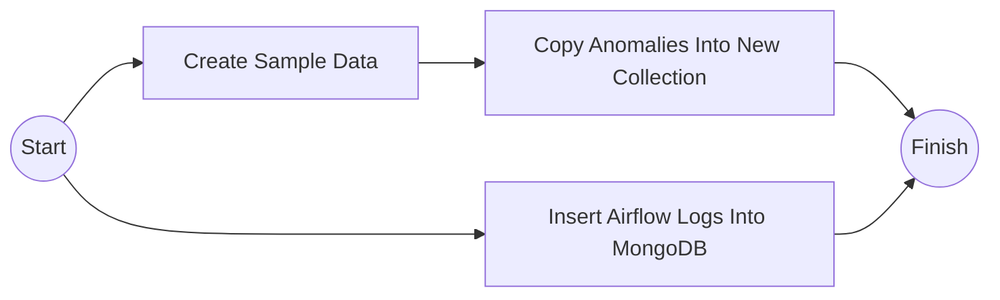

# Airflow DAG Projesi

Bu proje **Apache Airflow**, **MongoDB** ve **PostgreSQL** kullanarak rastgele veri üretimi, anomali tespiti ve log verilerinin MongoDB'ye kaydetme otomatikleştiren DAG içerir.

## İçerik

- Rastgele sıcaklık ve nem verisi üretimi
- Üretilen verilerin MongoDB'ye kaydedilmesi
- Anormal verilerin (sıcaklık > 30) farklı bir koleksiyona kopyalanması
- Airflow loglarının MongoDB'ye kaydedilmesi

## Başlangıç

Projeyi çalıştırabilmek için aşağıdaki sistemlerin kurulu olması gerekmektedir:

- Apache Airflow
- MongoDB
- PostgreSQL (Airflow logları için)

Ayrıca gerekli Python kütüphaneleri:

```bash
pip install apache-airflow pymongo psycopg2
```

## Kurulum

1. Gerekli bağımlılıkları yükleyin.
2. Airflow ortamınızı başlatın (`airflow init`, `airflow webserver`, `airflow scheduler`).
3. `homework.py` dosyasını Airflow'un src/dags klasörünüze yerleştirin.
4. MongoDB bağlantı bilgilerini ve PostgreSQL ayarlarının doğru olduğundan emin olun.

> **Not:** Projedeki MongoDB bağlantı URI'si doğrudan kodda yer almaktadır. Güvenlik açısından `.env` dosyası gibi bir yapı tercih edilmelidir.

## Metodların Görevleri

- `create_sample_data`: MongoDB'ye rastgele sıcaklık ve nem verisi kaydeder.
- `copy_anomalies_into_new_collection`: Sıcaklığı 30°C'nin üzerinde olan verileri ayrı bir koleksiyona taşır.
- `insert_airflow_logs_into_mongodb`: Airflow log event sayılarını MongoDB'ye kaydeder.

## Akış Diyagramı


